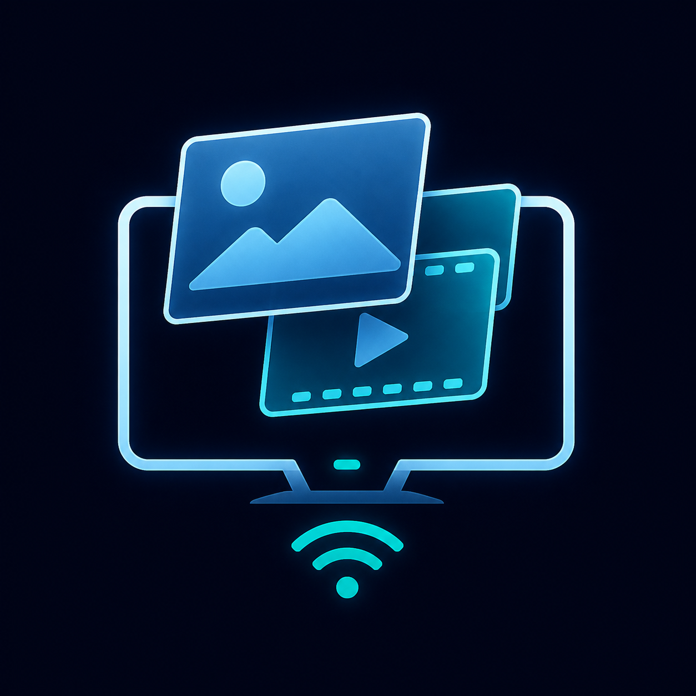

  

  <strong>English</strong> · <a href="README.ru.md">Русский</a>

# mirror-to-tv

A local-network utility for sending images, animated GIFs, video overlays, and audio from a Windows PC to a TV. The source code is fully open, and no cloud services are used.

## Compatibility

### Tested configuration

| Component | Specification |
| --- | --- |
| TV platform | Xiaomi `MiTV-MOSR1` / `hermano_eu`, used by 32-inch Xiaomi TV A2 and P1E models |
| Operating system | Android TV 11 (API 30) |
| Architecture | ARMv7 |
| Memory | 1.5 GB RAM, 8 GB storage |
| Xiaomi TV A2 32 hardware | 1366 × 768 at 60 Hz, quad-core Cortex-A55, Mali-G31 MP2, dual-band Wi-Fi ([official specifications](https://www.mi.com/global/product/xiaomi-tv-a2-32/specs/)) |

### Platform support

| Platform | Status | Requirements and notes |
| --- | --- | --- |
| Android TV / Google TV | Expected compatibility | Android 6.0 (API 23) or newer; firmware support for ADB over the local network and the `Display over other apps` permission. Other models have not been verified. |
| Amazon Fire TV | Expected compatibility, untested | Fire OS 6 or newer; these versions are based on Android API 25 or newer and support network ADB ([Amazon documentation](https://developer.amazon.com/docs/fire-tv/fire-os-overview.html)). |
| Samsung Tizen, LG webOS, Roku, Apple TV | Not supported | The receiver requires Android APIs. |
| Windows PC | Supported controller platform | Windows 10 or Windows 11. |

## Installation

The TV and PC must be connected to the same home network.

### 1. Prepare the TV

1. Open **Settings → About → Product model** and press the OK button seven times. Xiaomi documents this as the way to reveal developer access on Mi TV and Mi Box ([Xiaomi instructions](https://www.mi.com/uk/support/article/KA-06513/)). On some Android TV or Google TV firmware, the item is named **Build** instead.
2. Return to **Settings → Account & Security**, open **ADB debugging**, and choose **Allow**.
3. Open **Settings → Network & Internet → your connected Wi-Fi or Ethernet network**. Write down the **IP address** shown there. This is the address of the TV, for example `192.168.1.50`.

### 2. Install and start

1. Download `mirror-to-tv-1.0.zip` from the repository Releases page and extract the entire archive. Do not run it from inside the ZIP.
2. Run `Install-Mirror-To-TV.cmd`, enter the TV IP address, and keep the default ADB port `5555` unless the TV shows a different port.
3. If an authorization dialog appears on the TV, choose **Always allow from this computer** and then **Allow**.

The installer connects to the TV, installs the APK, grants the overlay permission, starts and verifies the receiver, remembers the TV address, and opens the desktop controller. It does not reboot the TV. For later use, run `Start-Mirror-To-TV.cmd`.

ADB is included in the release archive; Android Studio is not required. Its Apache 2.0 notices are included in `tools/NOTICE.txt`. If the connection fails, confirm that both devices are on the same non-guest network and that the router does not isolate Wi-Fi clients.

## License

The source code is distributed under the [MIT License](LICENSE).
